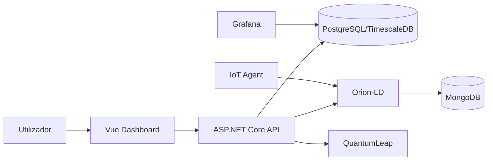

# Notas Técnicas — DriveTrace Core

Documento de referência para docentes/avaliadores e para developers. Descreve a
arquitetura, as decisões técnicas e as limitações conhecidas. É honesto quanto
ao estatuto de **protótipo avançado / V1**, não de produto industrial final.

## 1. Arquitetura

- **Frontend**: Vue 3 + TypeScript + Vite + Tailwind. Pinia e Vue Router
  introduzidos como base arquitetural. Tabela de rotas central como fonte única
  de navegação; vistas pesadas (grafo, dashboards, simulador) carregadas com
  *code-splitting*.
- **Backend**: ASP.NET Core 8 + EF Core + Npgsql. Camadas separadas
  (Controllers finos, Services com lógica, Data/Models/DTOs, Permissions,
  Middleware).
- **Observabilidade/contexto**: FIWARE (Orion-LD, MongoDB, IoT Agent,
  QuantumLeap) e Grafana sobre PostgreSQL.

## 2. Domínio

Rastreabilidade e monitorização de WIP em contexto industrial/automóvel:
ordens, unidades, suportes, racks, materiais/lotes, qualidade, não
conformidades, retrabalho, recondicionamento, sucata, transferências entre
linhas, simulador e analítica operacional. A narrativa é **determinística** —
sem previsões, *forecast* ou recomendações de IA.

## 3. Base de dados

- `DriveTraceDbContext` (EF Core) define o modelo; `SchemaEvolution.cs` aplica
  evoluções idempotentes no arranque; `DemoSeeder.cs` semeia dados demo ricos e
  idempotentes.
- O *seeding* corre no arranque quando `Database:SeedDemoData=true`.
- **Nomes físicos PT-PT**: a abordagem defensável adotada mantém os nomes
  internos em C# (menor risco/regressão) e concentra a terminologia PT-PT na
  camada visível ao utilizador (UI, etiquetas, dashboards). A migração total do
  *schema* físico para PT-PT via Fluent API é o passo seguinte recomendado e foi
  deixada fora desta iteração por ser de risco elevado sem validação integral
  contra as *queries* SQL e os dashboards.

## 4. PT-PT

- Interface por defeito em **PT-PT** (`src/i18n/pt-PT.ts`), com EN como
  secundário (`src/i18n/en.ts`).
- Novos módulos (`utils/`, `stores/`, `router/`, `components/common/`) usam
  PT-PT em tudo o que é visível e comentários em PT-PT; o código mantém nomes em
  inglês, conforme norma.
- O portal do cliente não expõe linguagem técnica interna.

## 5. FIWARE

- `FiwareContextService` mantém a coerência entre o *snapshot* relacional e o
  contexto NGSI-LD; `publish-current` e a limpeza de entidades obsoletas
  (*stale cleanup*) são preservados.
- O Grafana é uma ferramenta de analítica embebida em contexto demo, **não** a
  interface principal.

## 6. Grafana

- Dashboards provisionados em `grafana/`. As *labels* visíveis ao utilizador
  devem estar em PT-PT.

## 7. Docker

- `docker-compose.yml` orquestra BD, API, frontend, FIWARE e Grafana.
- A cadeia de ligação é injetada por variável de ambiente
  (`ConnectionStrings__DefaultConnection`), não fica fixada no código.
- `.env.example` documenta as variáveis; segredos reais nunca são versionados.

## 8. Permissões e autenticação

- **A autenticação é demo/local.** O frontend envia cabeçalhos
  `X-DriveTrace-Role` / `X-DriveTrace-User`; o backend reavalia as permissões
  por perfil em `PermissionCatalogService` (fonte de verdade no servidor, não
  apenas no cliente).
- Esta camada **não é segurança de produção**. O caminho para autenticação real
  (por exemplo, *cookies* seguros ou OIDC) pode ser adicionado sem quebrar a
  versão demo, substituindo a resolução de identidade por cabeçalhos por um
  esquema autenticado, mantendo o mesmo modelo de permissões.
- O guard do router (`src/router/guards.ts`) é uma **função pura** testada que
  espelha o mapa de acessos e isola o cliente das vistas internas.

## 9. Endurecimento (hardening) aplicado

- `Program.cs`: `AddProblemDetails()` + `UseExceptionHandler()` +
  `UseStatusCodePages()` para respostas de erro normalizadas (RFC 7807).
- `SecurityHeadersMiddleware`: `X-Content-Type-Options`, `X-Frame-Options`,
  `Referrer-Policy`, entre outros.
- CORS com origens configuráveis (`Cors:AllowedOrigins`).
- Endpoint `/health` para *healthchecks* e CI.
- Serialização: ciclos ignorados, *nulls* omitidos, *enums* como string.

## 10. Frontend — decisões de refactor

- Estratégia **repo-first, sem regressões**: o `App.vue` existente (monólito)
  mantém-se como autoridade de renderização enquanto se introduz a base modular
  à sua volta — a opção de "refactor seguro" em vez de reescrita cega.
- Camadas novas, testáveis e reutilizáveis:
  - `utils/status.ts` — extração fiel da lógica de cores de estado.
  - `utils/access.ts` — mapa único de perfis/permissões/vista inicial.
  - `utils/format.ts` — formatadores PT-PT.
  - `components/common/` — biblioteca de componentes acessíveis (StatusBadge,
    KpiCard, EmptyState, LoadingState, PageHeader, StatStrip,
    ConfirmationDialog, SmartFormField, DecisionCard, TimelineStep,
    ActivityFeed).
  - `stores/` — Pinia (auth, preferences, ui), partilhando as chaves de
    `localStorage` existentes para coexistência sem regressões.
  - `router/` — tabela de rotas + guards puros + *lazy-loading*.
  - `styles/tokens.css` — tokens semânticos com tema escuro e foco acessível.
- **Performance**: divisão de código por rota e *manualChunks* de *vendor*
  reduziram o *chunk* inicial JS de **~182 kB gzip para ~68 kB gzip** (o motor de
  grafo `@vue-flow` e as vistas pesadas deixam de pesar no arranque).

## 11. Testes

- **Frontend (Vitest)**: 44 testes unitários sobre `utils`, `stores`, guards do
  router e componentes partilhados. Verde localmente.
- **Frontend (Playwright)**: fluxos críticos por perfil e isolamento do cliente.
- **Backend (xUnit)**: testes unitários de lógica pura de perfis/permissões
  (`PermissionCatalogServiceTests`).
- A integração real controlada (WebApplicationFactory + Testcontainers) está
  preparada como passo seguinte e documentada; requer infraestrutura de BD.

## 12. Limitações conhecidas

- O `App.vue` continua extenso: a migração para renderização sob `<router-view>`
  por vista é o próximo incremento de baixo risco (a infraestrutura de router já
  existe e está testada).
- Autenticação é demo/local (ver secção 8).
- O *schema* físico permanece com nomes internos em inglês; a terminologia PT-PT
  vive na camada de apresentação (ver secção 3).
- As metas Lighthouse devem ser confirmadas no ambiente representativo via
  `npm run lighthouse`; o *code-splitting* aplicado favorece os objetivos de
  *bundle*, mas os números finais dependem do ambiente de execução.
